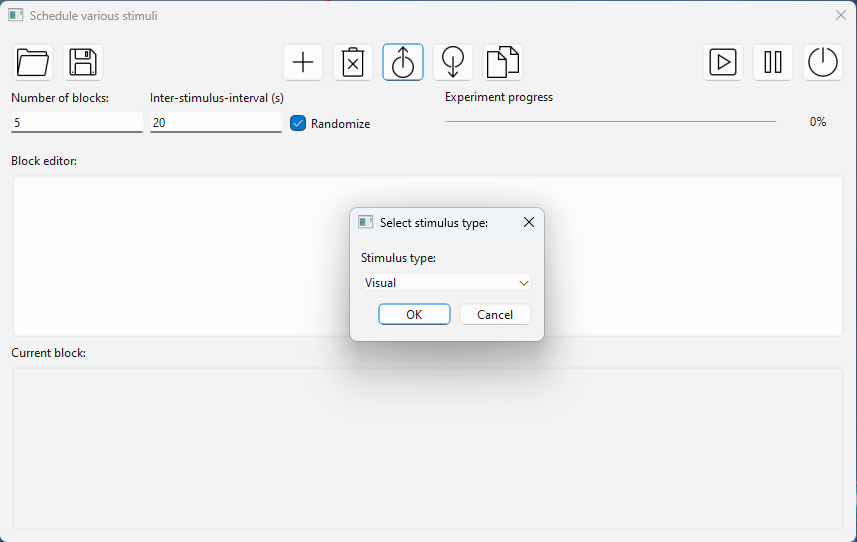
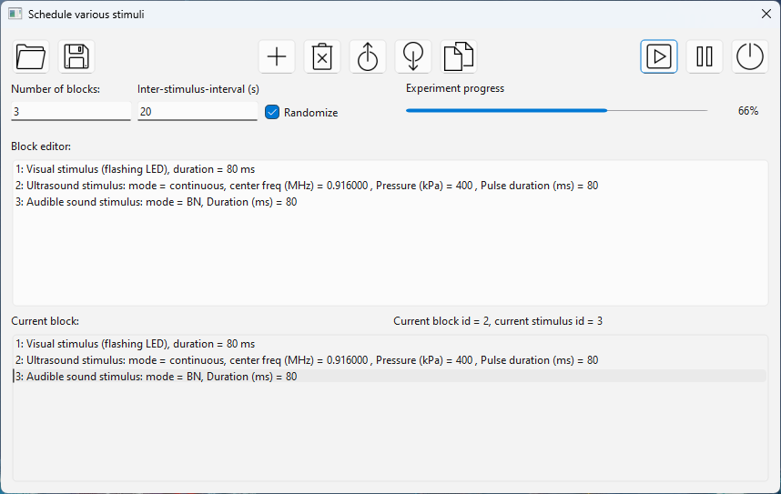
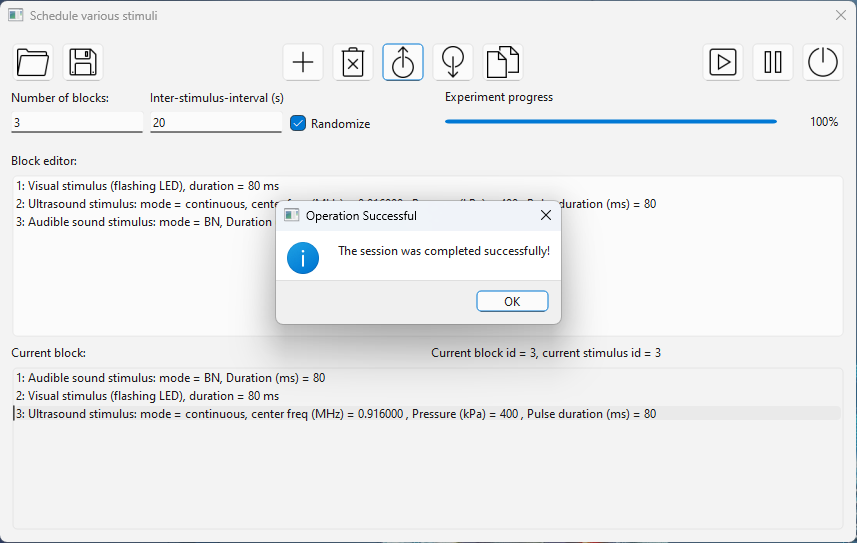

# Table of Contents
- [StimuliScheduler](#StimuliScheduler)
  - [Features](#Features)
- [FailSafe](#FailSafe)

# StimuliScheduler
## Features

## Screenshots

# FailSafe
## Features
- Sanity check the connection of the focused ultrasound equipment set-up
- Real-time monitoring of voltage data acquired from an NI-DAQ card
- Trigger an electronic relay when detecting a voltage beyond the threshold
- Save the data and logs of abnormal events

## Main window

- Stop running when detecting a high voltage. The threshold can be customized.

